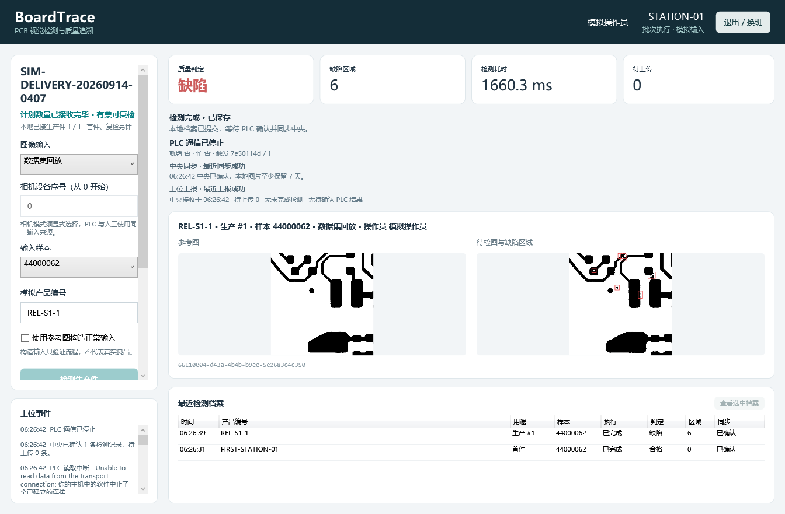
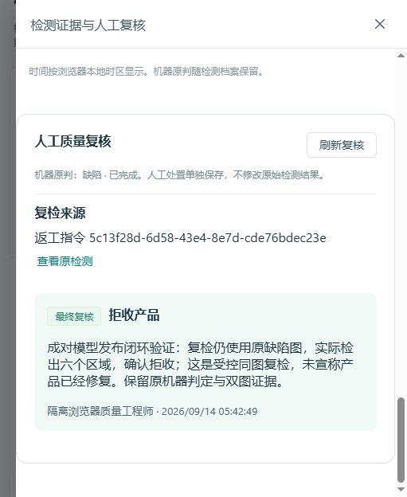
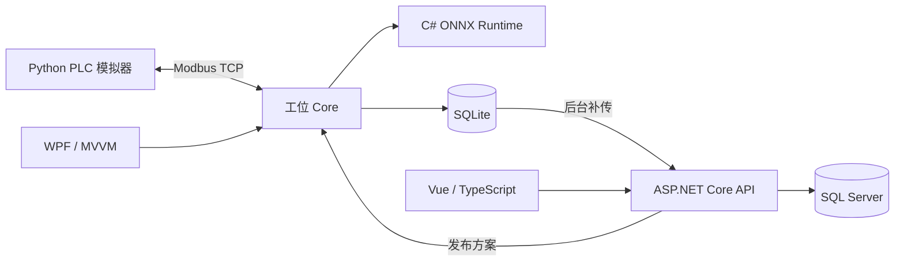

# BoardTrace

PCB 缺陷检测与质量追溯系统：从检测方案验证、工位执行，到质量复核、返工复检和批次关闭，保留每件产品的图像、判定与处理记录。

**[一分钟概览](https://berlin6908.github.io/BoardTrace/overview.html)** · **[4 分 30 秒完整回放](https://berlin6908.github.io/BoardTrace/demo.html)** · **[源码运行说明](../showcase/RUNNING.md)** · **[源码与离线演示](https://github.com/berlin6908/BoardTrace/releases/latest)**

生产与中央同步完成后的真实工位界面。演示由实际运行截图和结果组成，可暂停、换章及拖动时间轴。

## 已验证结果

| 项目 | 实测结果 | 范围 |
| --- | --- | --- |
| 缺陷检测 | Precision **95.06%**，Recall **97.42%** | DeepPCB 官方 500 个测试视野，框级微平均；同类、IoU ≥ 0.5 |
| 执行完成 | **500 / 500**，0 执行失败 | 固定模型及六类阈值，实际 Windows C# ONNX 推理 |
| 工位检测耗时 | warm p95 **1.22 秒** | Ryzen 5 3600，单 CPU 工位；首图后 499 次 Detect |
| 中央停机补传 | 双工位 **40 / 40** 件完整上传 | 独立 Modbus TCP 模拟器触发；中央恢复后核对记录及双图 SHA-256 |

以上测量完成于 2026-09-14。Detect 包含图像解码、预处理、推理与后处理；完整生产周期还包括接件、保存、设备确认和上传。200 个开发验证视野用于选模、阈值选择及方案验证，未计入 500 个测试视野。

输入采用公开 [DeepPCB](https://github.com/tangsanli5201/DeepPCB) 成对图像回放，PLC 使用独立模拟器；缺陷结论由实际图像算法生成。验证范围为软件业务闭环与模拟设备通信，尚未进行实体相机、PLC 或真实产线验收。

## 业务闭环

- **方案与版本**：中央验证模型和阈值后发布完整方案，将模型、参考图、参数和验证结果绑定到不可变版本；工位按版本下载并缓存。
- **批次与首件**：操作员绑定工位、批次和方案；首件批准后开始生产，生产序号与每次接件一起持久保存。
- **真实视觉检测**：WPF 调用 C# ONNX Runtime，使用待检图、参考图与差分输入，检测 open、short、mousebite、spur、copper、pin-hole 六类缺陷。
- **本地事务**：SQLite 先保存接件身份，再将双图、检测终态和待上传记录一并提交；结果保存成功后才向 PLC 发布有效结果。
- **两路确认与补传**：PLC ACK 确认设备读取结果；中央回执确认档案上传。两路确认分别持久化，完整缓存且获批的在制批次在中央离线期间继续执行和保存，恢复后按原记录自动补传。
- **质量与返工**：人工复核保留原机器判定，返工和复检形成关联记录；批次关闭前核对待处理事项，追溯检测图像、方案版本和处理历史。

## 实现结构

| 模块 | 职责与入口 |
| --- | --- |
| [Station](../src/BoardTrace.Station) | WPF 界面、人员登录、工位状态与图像展示；CommunityToolkit.Mvvm |
| [Station.Core](../src/BoardTrace.Station.Core) | 接件状态机、批次门禁、SQLite 事务、Modbus 握手与后台上传 |
| [Vision](../src/BoardTrace.Vision) | 成对 ONNX 推理、图像预处理和缺陷结果；ONNX Runtime、OpenCvSharp |
| [Server](../src/BoardTrace.Server) | ASP.NET Core、Identity、EF Core；方案、批次、检测档案和质量 API |
| [Web](../src/boardtrace-web) | Vue、TypeScript、Element Plus；工艺发布、质量复核与追溯 |
| [Contracts](../src/BoardTrace.Contracts) | 工位与中央共用的类型化业务协议 |
| [Training](../training) / [Simulator](../tools/simulator) | PyTorch / TorchVision 训练、ONNX 评估与独立 PyModbus 模拟器 |

手动检测、PLC 触发和复检共用 [InspectionCoordinator](../src/BoardTrace.Station.Core/InspectionCoordinator.cs)。视觉模块独立于数据库、HTTP 和界面；上传由 [InspectionUploader](../src/BoardTrace.Station.Core/InspectionUploader.cs) 从本地待传记录执行。

## 运行与验证

按 [源码运行说明](../showcase/RUNNING.md) 配置 Windows、.NET、Node.js、Python、SQL Server LocalDB 和输入资产，再启动中央服务、WPF 工位及模拟器。

- [CI 工作流](workflows/ci.yml)：Web 类型检查与构建、锁定依赖的 .NET 构建、SQLite / SQL Server 测试、Python 测试。
- [.NET 行为测试](../tests)：方案发布、批次与返工、事务保存、重复触发、PLC ACK、恢复及补传。
- [Python 测试](../tests/python)：训练检查点、评估匹配、全人口计分与模拟器。
- [系统验证脚本](../scripts/Test-SystemValidation.ps1)：双工位正常运行、重复 / Busy、ACK 丢失及中央停机恢复。
- [数据划分清单](../training/manifests)与[评分实现](../training/detection_evaluation.py)：固定训练 / 验证 / 测试划分及框级评估口径。
